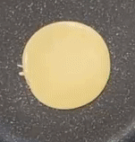
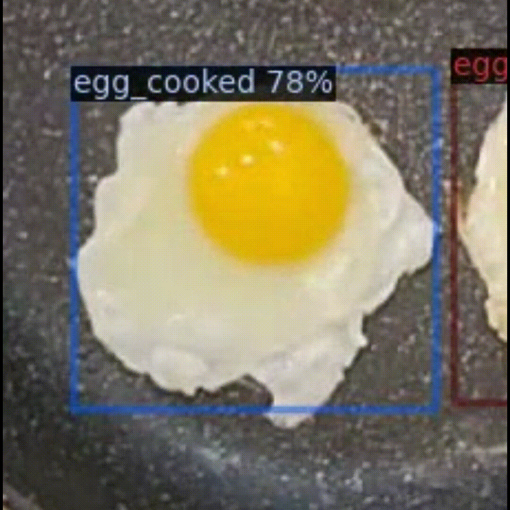
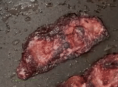
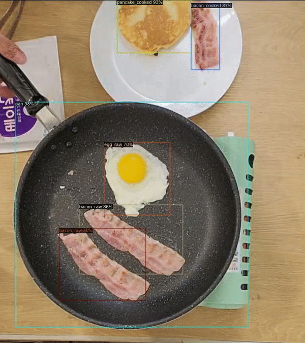
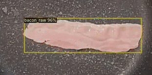
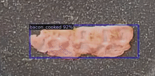

# YOCO : You Only Cook Once

YOCO is a cooking AI based on the Unbiased teacher v2 network. It helps users cook easily by predicting doneness of the ingredients.


<table>
      <tr>
            <th></th>
            <th></th>
            <th></th>
            <th></th>
            <th></th>
            <th></th>
            <th></th>
            <th></th>
            <th></th>
            <th></th>
            <th></th>
            <th></th>
      </tr>
    <tr style="padding: 0;">
	<td colspan="3" align = "center" ></td>
	<td colspan="3" align = "center" ></td>
	<td colspan="4" align = "center" ></td>
	<td colspan="4" rowspan="2" align = "center" bgcolor="skyblue"></td>
    </tr>
    <tr style="padding: 0;">
	<td colspan="5" align = "center" ></td>
	<td colspan="5" align = "center" ></td>
    </tr>
</table>

<!-- 
 
-->

## Model: Unbiased Teacher v2 (Anchor-free)

We are benchmarking the model from this paper: <br>
**Unbiased Teacher v2: Semi-supervised Object Detection for Anchor-free and Anchor-based Detectors**<br>
[Yen-Cheng Liu](https://ycliu93.github.io/), [Chih-Yao Ma](https://chihyaoma.github.io/), [Zsolt Kira](https://www.cc.gatech.edu/~zk15/)<br>
The IEEE / CVF Computer Vision and Pattern Recognition Conference (CVPR), 2022 <br>

[[Paper](https://openaccess.thecvf.com/content/CVPR2022/papers/Liu_Unbiased_Teacher_v2_Semi-Supervised_Object_Detection_for_Anchor-Free_and_Anchor-Based_CVPR_2022_paper.pdf)] [[Project](https://ycliu93.github.io/projects/unbiasedteacher2.html)]

<p align="center">

</p>

You can check the original PyTorch implementation of the paper [here](https://github.com/facebookresearch/unbiased-teacher-v2).

## Train
### Data
We used our own dataset with 3 dishes: **bacon**, **egg**, and **pancake**. It has 12 classes including *food, pan, others, bacon_raw, bacon_cooked, bacon_overcooked, egg_raw, egg_cooked, egg_overcooked, pancake_raw, pancake_cooked, and pancake_overcooked*.

|    |    |    |
|:---|:---|:---|
|food|pan|others|
|bacon_raw|bacon_cooked|bacon_overcooked|
|egg_raw|egg_cooked|egg_overcooked|
|pancake_raw|pancake_cooked|pancake_overcooked|

### Training FCOS

- Train Unbiased Teacher v2 under 40% COCO-supervision (adjust SUP_PERCENT for different ratio )

```shell
python train_net_yoco.py\
      --num-gpus 1 \
      --config configs/FCOS/coco-standard/yoco_fcos_R_50_ut2_run0.yaml \
       SOLVER.IMG_PER_BATCH_LABEL 4 SOLVER.IMG_PER_BATCH_UNLABEL 4  \
       SOLVER.MAX_ITER 50000 SEMISUPNET.BURN_UP_STEP 20000  \
       TEST.EVAL_PERIOD 500 DATALOADER.SUP_PERCENT 40.0
```

### Resume the training

```shell
python train_net_yoco.py \
      --resume \
      --num-gpus 1 \
      --config configs/FCOS/coco-standard/yoco_fcos_R_50_ut2_run0.yaml \
       SOLVER.IMG_PER_BATCH_LABEL 4 SOLVER.IMG_PER_BATCH_UNLABEL 4  \
       SOLVER.MAX_ITER 50000 SEMISUPNET.BURN_UP_STEP 20000  \
       TEST.EVAL_PERIOD 500 DATALOADER.SUP_PERCENT 40.0  \
       MODEL.WEIGHTS <weight_file_name>.pth
```

## Inference Only

- Adjust INFERENCE_TH_TEST for different threshold

```shell
python train_net.py \
      --test-only \
      --num-gpus 1 \
      --config configs/FCOS/coco-standard/yoco_fcos_R_50_ut2_run0.yaml \
      --output_dir <output_file_directory> \
      --video_input <input_file_path> \
      MODEL.WEIGHTS <weight_file_name>.pth \
      MODEL.FCOS.INFERENCE_TH_TEST 0.4
```

## License

This project is licensed under [MIT License](LICENSE), as found in the LICENSE file.

<br>
<br>
<br>

## Contributors

[](https://github.com/jisoo1738)<br>Jisoo|[](https://github.com/jw00oo1)<br>Jiwoo|[](https://github.com/mingkyun)<br>Minkyun|[](https://github.com/kimsoyeong)<br>Soyeong|
|:--:|:--:|:--:|:--:|
