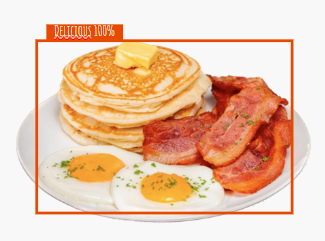
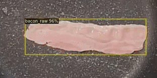
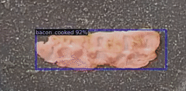
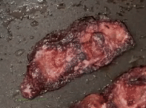

# YOCO : You Only Cook Once

 


# Unbiased Teacher v2: Semi-supervised Object Detection for Anchor-free and Anchor-based Detectors

 [](https://opensource.org/licenses/MIT)

This is the PyTorch implementation of our paper: <br>
**Unbiased Teacher v2: Semi-supervised Object Detection for Anchor-free and Anchor-based Detectors**<br>
[Yen-Cheng Liu](https://ycliu93.github.io/), [Chih-Yao Ma](https://chihyaoma.github.io/), [Zsolt Kira](https://www.cc.gatech.edu/~zk15/)<br>
The IEEE / CVF Computer Vision and Pattern Recognition Conference (CVPR), 2022 <br>

[[Paper](https://openaccess.thecvf.com/content/CVPR2022/papers/Liu_Unbiased_Teacher_v2_Semi-Supervised_Object_Detection_for_Anchor-Free_and_Anchor-Based_CVPR_2022_paper.pdf)] [[Project](https://ycliu93.github.io/projects/unbiasedteacher2.html)]

<p align="center">

</p>

# What's new in Unbiased Teacher v2

- Higher Accuracy: Achieve higher mAP compared to Unbiased Teacher v1
- Generalization: SSOD method for both Faster-RCNN and FCOS

## Training

### FCOS

- Train Unbiased Teacher v2 under 10% COCO-supervision

```shell
python train_net.py \
      --num-gpus 4 \
      --config configs/FCOS/coco-standard/fcos_R_50_ut2_sup10_run0.yaml \
       SOLVER.IMG_PER_BATCH_LABEL 8 SOLVER.IMG_PER_BATCH_UNLABEL 8
```

## Resume the training

```shell
python train_net.py \
      --resume \
      --num-gpus 8 \
      --config configs/FCOS/coco-standard/fcos_R_50_ut2_sup10_run0.yaml \
       SOLVER.IMG_PER_BATCH_LABEL 8 SOLVER.IMG_PER_BATCH_UNLABEL 8 MODEL.WEIGHTS <your weight>.pth
```

## Evaluation

```shell
python train_net.py \
      --eval-only \
      --num-gpus 8 \
      --config configs/FCOS/coco-standard/fcos_R_50_ut2_sup10_run0.yaml \
       SOLVER.IMG_PER_BATCH_LABEL 8 SOLVER.IMG_PER_BATCH_UNLABEL 8 MODEL.WEIGHTS <your weight>.pth
```

## License

This project is licensed under [MIT License](LICENSE), as found in the LICENSE file.
